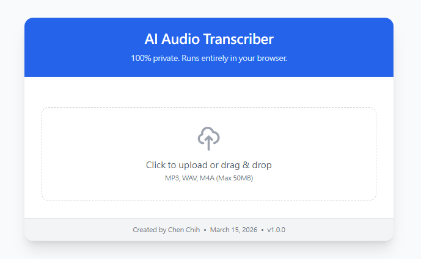
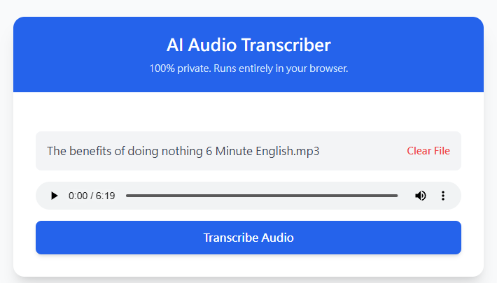
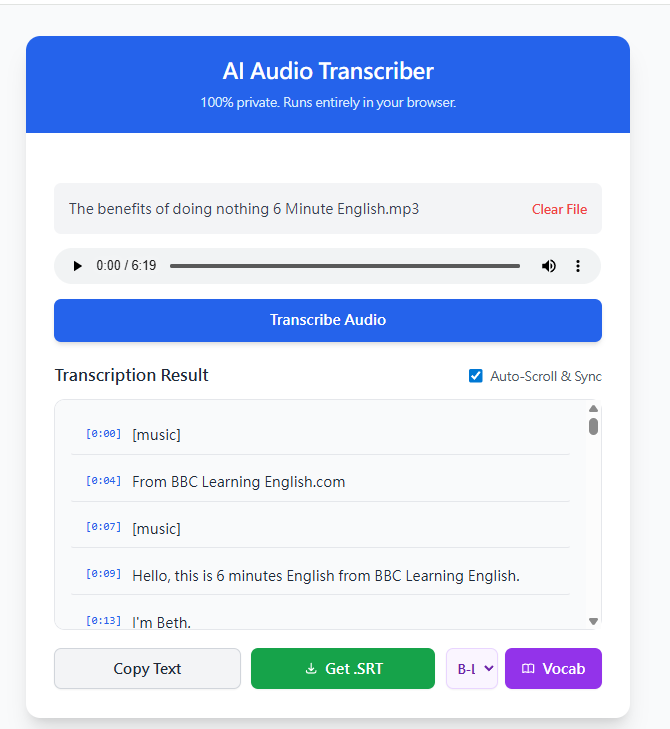
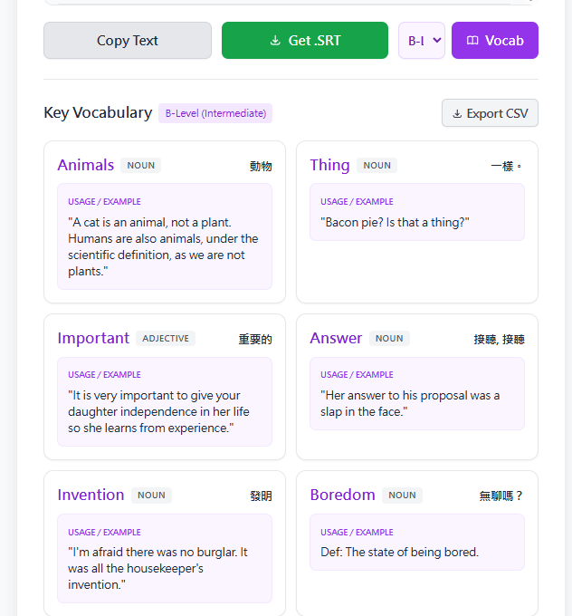

# 🎙️AI Audio Transcriber & Vocab Study Tool

- Live App: https://chenchih.github.io/audio-transcriber


A 100% private, client-side web application designed to **convert audio files into interactive transcripts**, generate **useful vocabulary lists** for English learners, and **export study materials to CSV**.

Built with vanilla JavaScript and Hugging Face's Transformers.js, this tool requires **no API keys**, **no backend server**, and ensures your data **never leaves your device**.

## 🎯 Primary Features

* **Convert Audio to Transcript:** Drag and drop any MP3, WAV, or M4A file (up to 50MB) to generate a highly accurate, timestamped transcript.

* **CEFR-Level Vocabulary Generation: Select your target difficulty (A-Level Basic, B-Level Intermediate, or C-Level Advanced). The app analyzes the transcript, filters out common words based on your chosen level, and extracts complex/useful English vocabulary using smart heuristics and suffix detection.

* **Rich Definitions & Translations:** Automatically fetches the Part of Speech, English definition, daily usage examples, and Traditional Chinese translations for each extracted word.

* **Export to CSV:** Download your generated vocabulary list as a `.csv` file, perfectly formatted for immediate import into flashcard apps like Anki or Quizlet.

* **Interactive Dictation (Karaoke Mode):** The transcript automatically highlights and scrolls in sync with the audio playback. Click any sentence to instantly jump the audio to that timestamp!

* **Download Subtitles (.SRT):** Easily export your transcription with precise timestamps for video editing.

## 🔒 Privacy & Technology

* **100% Local Processing:** All AI transcription math happens locally inside your browser's WebAssembly engine via a Background Web Worker (preventing UI freezes). Your personal audio files are *never* uploaded to the cloud.

* **Optimized for English:** The AI model is specifically forced into English transcription mode to drastically reduce hallucinations and maximize accuracy for ESL learners.

* **External APIs:** The app utilizes the `Free Dictionary API` and `MyMemory Translation API` purely for fetching vocabulary definitions and translations on the fly.

## 🚀 How to Run Locally

Because this application uses modern JavaScript Modules (`type="module"`) to load the AI engine and Web Workers, **you cannot simply double-click the `index.html` file to run it.** Browsers block local module loading for security reasons.
You must serve the file using a simple local web server:

### Option A: Using VS Code (Recommended)
1. Open the folder containing `index.html` in Visual Studio Code.
2. Install the free **"Live Server"** extension.
3. Right-click the `index.html` file and select **"Open with Live Server"**.

### Option B: Using Python (Mac/Linux/Windows)

1. Open your Terminal or Command Prompt.
2. Navigate to the folder where you saved the file:

   ```bash
   cd path/to/your/folder
   ```
3. Start the built-in Python server:
```
python -m http.server 8000
```

4. Open your web browser and go to http://localhost:8000.

## Limitations & Notes

* **File Size:** The application enforces a 50MB limit to prevent browser tabs from crashing due to WebAssembly memory limits.
* **First Run:** The first time you transcribe a file, the app needs to download the AI model (~40MB). It will be cached in your browser for instant loading on future visits.
* **API Limits:** Vocabulary extraction relies on free, public APIs (Free Dictionary API, MyMemory). Heavy usage might result in temporary rate-limiting for definitions or translations.

## Output

- TranscriptAudio


- Upload Audio


- Convert Audio to Transcript


- Vocab


